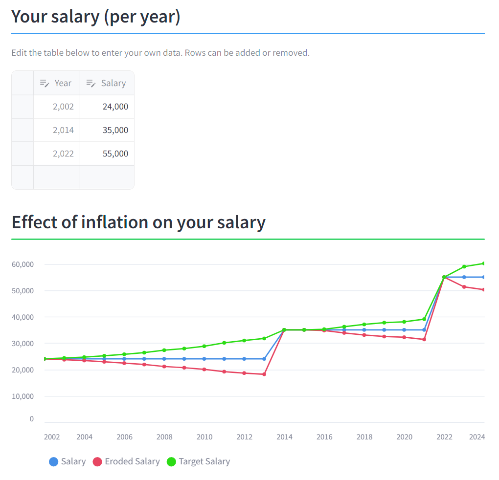

# Salary vs Inflation



## Description

This is the repository behind the [Salary vs Inflation](https://salary-vs-inflation.streamlit.app/) Streamlit app.

With this app, the user can make a chart of the evolution of their salary over time. The app automatically
calculates the "effective" salary compared to a reference year that the user can select.

## Additional information

### Origin of data

The Consumer Price Index (CPI) data for the UK was downloaded from the [ONS](https://www.ons.gov.uk/economy/inflationandpriceindices/timeseries/d7bt/mm23) website.

### Calculations

In order to convert the salary you had at a given year ($year1$) into the salary you should have had in $year2$
if it had followed the inflation, the following formula has been used:

```math
Salary_{year2} = Salary_{year1} \times \frac{CPI_{year2}}{CPI_{year1}}
```

$Salary_{year2}$ is called "target salary" and $year1$ is called "reference year".  
Note that, in order to get what your "reference salary" is actually worth in "$year2$'s money" (what I call the
"eroded salary"), then one can simply invert the ratio of CPIs.

```math
Salary_{eroded} = Salary_{ref} \times \frac{CPI_{ref}}{CPI_{year2}}
```

## Running the app locally

```bash
# clone the repo
git clone https://github.com/jobar8/salary-vs-inflation.git
cd salary-vs-inflation

# install requirements in a local env
python3 -m venv .venv
python3 -m pip install -e .

# run the app
streamlit run salary-vs-inflation.py
```

Alternatively, if you have [uv](https://docs.astral.sh/uv/) installed, you can create a local environment and
then run the app by running:

```bash
uv run streamlit
streamlit run salary-vs-inflation.py
```

## License

`salary-vs-inflation` is distributed under the terms of the [MIT](https://spdx.org/licenses/MIT.html) license.
